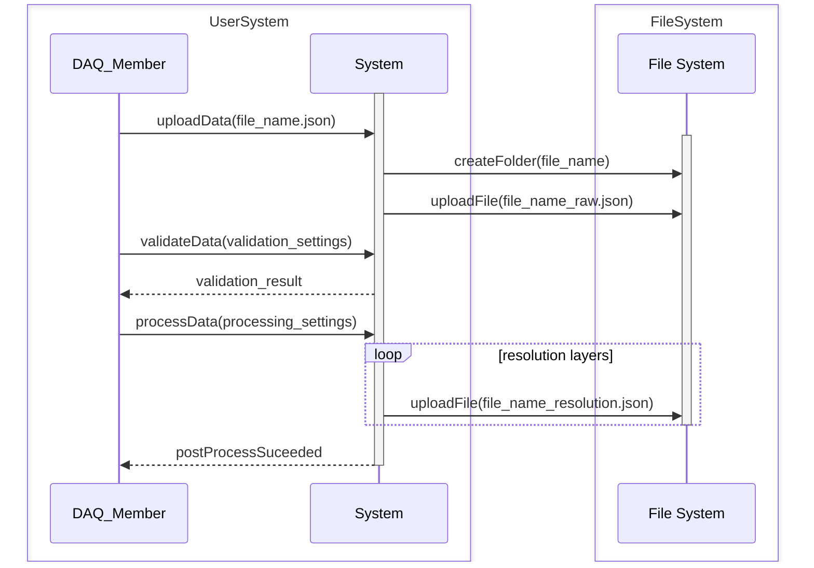

# Upload Data

# Explanation

DAQ member has collected data from the vehicle. This data is stored in our .json format. The DAQ member inputs metadata about the file, e.g description, data collected, collection location, sensor_format, etc. DAQ member uploads this file data on the website along with its metadata.. The server adds the data file into a **temporary buffer** in the database associated with the user, as well as the user provided metadata. The user then asks the server to validate the data. The server returns if the validation result. If this validation suceeded, the user then request the server to process the data. The server processes the data file, creating different resolution levels. The server moves the files once again to the **temporary buffer**. If the post processing suceeds, the user confirms the upload, and the files are moved from the temporary buffer to a folder for this data. If the user exits at any point, the temporary buffer is retained for the user to return to.