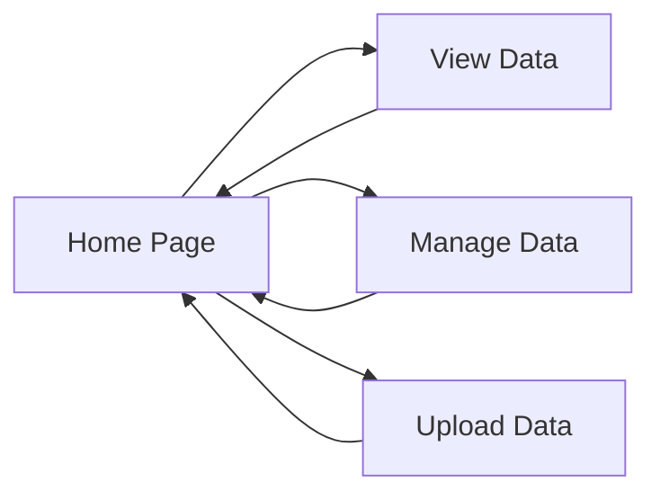

# Home 
The home page welcomes the user to the site

# Login / Sign up

Page to allow user to login / sign up

# Logout

Endpoint to allow use to signout

# Data
Home page to manage data, contains links to view and manage data

# Manage Data
Page that links to upload and manage data pages

# View Data
Lists all datasets available to view / download, provides options to sort and locate the right data set. Users will eventually have the option to filter by date, testing day, location, etc.

# Upload Data
Page that allows the authorized users to upload new data sets.

# Manage Data
Page that allows authorized users to modify or delete existings data sets. Modifying data sets would include changing the processing stack used to process the raw data.

**Note:** Log in / Sign up / Logout pages are accesible from all pages.

